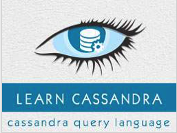

```
Roberto Nogueira  
BSd EE, MSd CE
Solution Integrator Experienced - Certified by Ericsson
```
# TutorialsPoint Cassandra



**About**

Learn everything you need to about the subject of this `Tutorialspoint` project.

[Homepage](https://www.tutorialspoint.com//cassandra/index.htm)

## Topics
```
Cassandra Tutorial
[x] Home
[x] Introduction
[x] Architecture
[x] Data Model
[ ] Installation
[ ] Referenced Api
[ ] Cqlsh
[ ] Shell Commands
Cassandra Keyspace Operations
[ ] Create Keyspace
[ ] Alter Keyspace
[ ] Drop Keyspace
Cassandra Table Operations
[ ] Create Table
[ ] Alter Table
[ ] Drop Table
[ ] Truncate Table
[ ] Create Index
[ ] Drop Index
[ ] Batch
Cassandra CURD Operations
[ ] Create Data
[ ] Update Data
[ ] Read Data
[ ] Delete Data
Cassandra CQL Types
[ ] CQL Datatypes
[ ] CQL Collections
CQL User Defined Datatypes
Cassandra Useful Resources
[ ] Quick Guide
[ ] Useful Resources
[ ] Discussion
[ ] Selected Reading
[ ] Developer's Best Practices
[ ] Questions and Answers
[ ] Effective Resume Writing
[ ] Computer Glossary
[ ] Who is Who
```
